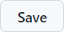

<div align="center">
    
    <h1>Lee's Planit</h1>
</div>

**Planit** is an assignment tracker for students that automatically compiles due dates into an interactive calendar. This deployment guide of Planit specifically pertains to @afeawoL’s courses, assignments, and announcements. Because certain online homework platforms, such as GradeScope Blackboard, don’t offer student APIs, web scraping is required to retrieve assignment details. **HTTP requests** are used alongside **Beautiful Soup** for web scraping, automatically executed multiple times per day using **GitHub Actions**. **Modified from github.com/tanjeffreyz/planit**.

<div align="center">
    
</div>


## Setup Instructions

1. On "https://github.com/tanjeffreyz/planit" Click <a href="#"></a> at the top of this page, 
which should open the following prompt. <b>Make sure "Include all branches" is checked:</b>
<div align="center">
    
</div>

2. Decide & enter a name for the new repository, keeping in mind that the repo name will be incorporated into the URL for the 
<b>"Planit: Lee's Homepage"</b> webpage, so it's best to keep it short and <s>memorable</s> sweet, like "planit" or "planit-myname". 
Then, click <a href="#"></a>.

3. Visit your new repository's secrets at the following link:
```
https://github.com/afeawoL/planit_bsu/settings/secrets/actions
```

4. Create **two** new **Secrets**: 
Your **username** and **password**. 
<b>For each secret's "Name" field, you must only use the values listed below.
In the "Secret" field, enter either your username or password depending on the value you chose for the "Name" field.</b>

<table align="center">
    <tr><th align="center">Username</th><th align="center">Password</th></tr>
    <tr align="center"><td>BLACKBOARD_USER</td><td>BLACKBOARD_PASSWORD</td></tr>
</table>

5. Now, go to the following link:
```
https://github.com/afeawoL/planit_bsu/settings/actions
```

6. Under “Workflow Permissions,” ensure “Read and write permissions” is enabled:
<div align="center">
    
</div>

7. Next, navigate to:
```
https://github.com/afeawoL/planit_bsu/settings/pages
```

8. In the dropdown menu under "Branch", select "github-pages" and click
<a href="#"></a>:
<div align="center">
    
</div>

9. Lastly, from your repository's home page, go to `data/assignments.js`, **delete** the file, and click 
<a href="#"></a>. 

<br>

That's it! <b>Planit</b> will start retrieving assignment information roughly once every hour and update your 
personal planner at the link below, which can be accessed on any device.
```
https://afeawoL.github.io/planit_bsu
```
